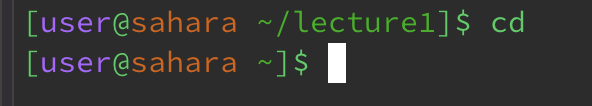
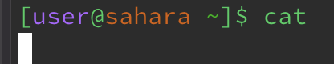
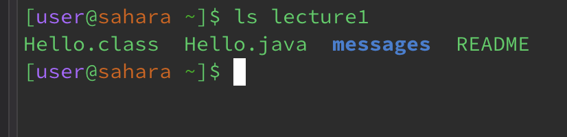
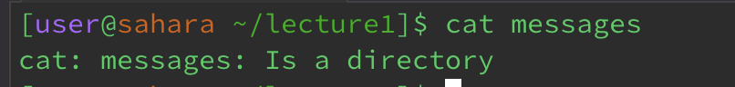
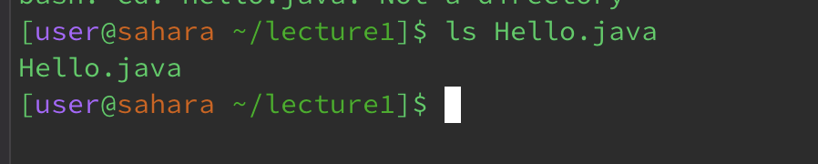
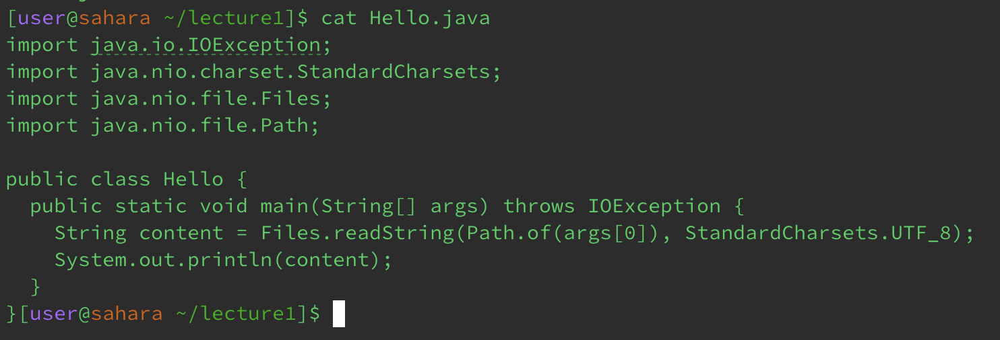

\
cd with no argument navigates you to the outermost directory.

\
cat with no argument allows you to write text in the terminal and it prints the same text.

\
ls with no argument tells you the directories and files within your current directory 

\
cd with a directory navigates you to the directory you are looking for. (The argument directory has to be within the current directory)

\
ls with a directory tells you the directories and files within your current directory.

\
cat with a directory does not print anything as the directory is not a file.

\
cd with a file as an argument gives you an error as you cannot navigate to a file you can only navigate to a directory.

\
ls with a file as an argument states the file. 

\
cat with a file prints out the output of the file when run. 
