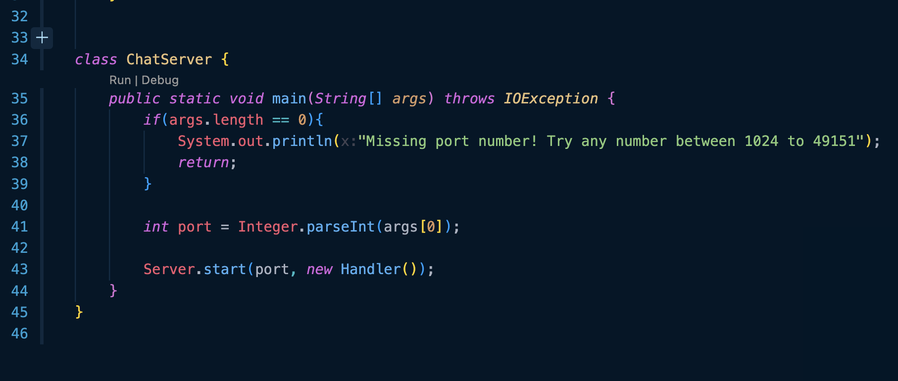

\
\
 
From the above code on line 9, the `handleRequest` method is called which takes a URL as an argument. This method is called after the server has started using the `Server.start` method.  
There are 3 instance variables in the `Handler` class which we use later.  
Here's the dry run of the code: 
A URL is used as an argument in the `handleRequest` method.  
We split this URL into 2 strings when we see a "&" which we store in an array called `parameters`. 
We further split the 2 elements of the string array when we see a "=" and store the 4 elements in a new string array called `finalVals`. 
We then check if the first and third elements in that array are the values "s" and "user" respectively. 
If the condition is met we save the second and fourth elements as the message and user respectively as the instance variables of the `Handler` class. 
We then format a string and save it as `ans = ans + "\n" + user + ": " + message` and this is important. 
Whenever we have another URL that passes through this method it appends the new message and user to the `ans` string while keeping the past history. 
\
\
 Using the above as examples we can see that the code works as expected. 
The ans string gets updated storing the previous chat history.  

\
 
The above command line shows the path to the private key.
 
\
 
The above command line shows the path to the public key on the ieng system.
 
\
 
The above command line shows logging into the `ssh` without a password and just the key.
 

Learning how to work with URLs has been interesting over the last few weeks.
