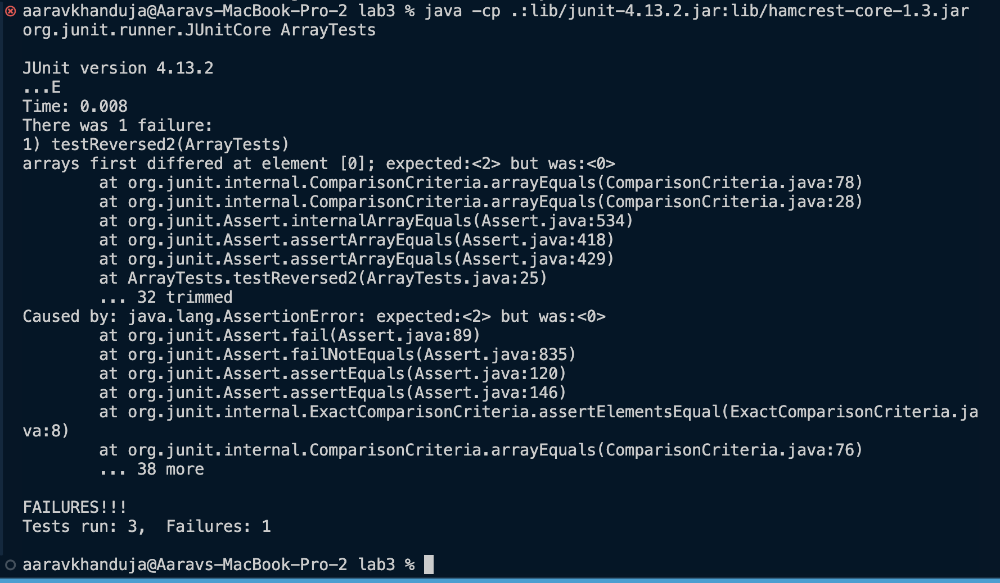

**Part 1** 
Here is the failure-inducing input as a JUnit test 
`@Test
  public void testReversed2() {
    int[] input1 = { };
    int[] input2 = {0, 1, 2};
    int[] expectedOutput2 = {2,1,0};
    assertArrayEquals(new int[]{ }, ArrayExamples.reversed(input1));
    assertArrayEquals(expectedOutput2, ArrayExamples.reversed(input2));
  }`

Here is the non-failure inducing input as a JUnit test 
`@Test
  public void testReversed() {
    int[] input1 = { };
    assertArrayEquals(new int[]{ }, ArrayExamples.reversed(input1));
  }`

Here is the output  
\
 

Here is the code before making the necessary changes.  
`static int[] reversed(int[] arr) {
    int[] newArray = new int[arr.length];
    for(int i = 0; i < arr.length; i += 1) {
      arr[i] = newArray[arr.length - i - 1];
    }
    return arr;
  }`
 
Here is the code after making the necessary changes.  
`static int[] reversed(int[] arr) {
    int[] newArray = new int[arr.length];
    for(int i = 0; i < arr.length; i += 1) {
      newArray[i] = arr[arr.length - i - 1];
    }
    return newArray;
  }`
   
Initially, the new array would repetitively assign each element to 0 as it would call the new array instead of updating the new array. 
The corrected code effectively updates the new array and returns it which contains the same elements in reversed order.  

**Part 2**  

The command that I find interesting is `find`. 
  

Here are 4 interesting ways it could be used:
   
1. It could be used to delete files matching the criteria you state  
For example, I could have a folder called test-folder which has a bunch of files.  
`aaravkhanduja@Aaravs-MacBook-Pro-2 test-folder % ls` 
`file.java	run2.txt	tester.txt
run1.txt	test.cpp	testerr.c`
   
Example 1:   
I could delete all `.txt` files using the command below  
`aaravkhanduja@Aaravs-MacBook-Pro-2 test-folder % find . -name "*.txt" -delete
aaravkhanduja@Aaravs-MacBook-Pro-2 test-folder % ls
file.java	test.cpp	testerr.c
aaravkhanduja@Aaravs-MacBook-Pro-2 test-folder %`
    
Example 2:   
I could delete all `.c` files using the command below  
`aaravkhanduja@Aaravs-MacBook-Pro-2 test-folder % find . -name "*.c" -delete
aaravkhanduja@Aaravs-MacBook-Pro-2 test-folder % ls
file.java	test.cpp	 
aaravkhanduja@Aaravs-MacBook-Pro-2 test-folder %`
  
2. It could also be used to count files matching the criteria you state  
For example, with the same folder called test-folder which has a bunch of files.  
`aaravkhanduja@Aaravs-MacBook-Pro-2 test-folder % ls 
file.java	run2.txt	tester.txt
run1.txt	test.cpp	testerr.c`
    
 
Example 1:  
I could count all `.cpp` files using the command below  
   `aaravkhanduja@Aaravs-MacBook-Pro-2 test-folder % find . -name "*.cpp" | wc -l`    
Output: 1
    
Example 2:  
I could count all `.txt` files using the command below  
`aaravkhanduja@Aaravs-MacBook-Pro-2 test-folder % find . -name "*.txt" | wc -l`   
Output: 1
    
4. It could also be used to zip files matching the criteria you state  
For example, with the same folder called test-folder which has a bunch of files. 
`aaravkhanduja@Aaravs-MacBook-Pro-2 test-folder % ls 
file.java	run2.txt	tester.txt
run1.txt	test.cpp	testerr.c`
    
Example 1:
  
 I could zip all `.c` files using the command below  
`aaravkhanduja@Aaravs-MacBook-Pro-2 test-folder % find . -name "*.c" -exec gzip {} \;  
aaravkhanduja@Aaravs-MacBook-Pro-2 test-folder % ls
file.java	test.cpp	testerr.c.gz`
aaravkhanduja@Aaravs-MacBook-Pro-2 test-folder % `
    

Example 2:
 
 I could zip all `.cpp` files using the command below  
`aaravkhanduja@Aaravs-MacBook-Pro-2 test-folder % find . -name "*.cpp" -exec gzip {} \;  
aaravkhanduja@Aaravs-MacBook-Pro-2 test-folder % ls
file.java	test.cpp.gz	testerr.c.gz
aaravkhanduja@Aaravs-MacBook-Pro-2 test-folder %`
  

4. It could also be used to archive files matching the criteria you state  
For example, with the same folder called test-folder which has a bunch of files.  
`aaravkhanduja@Aaravs-MacBook-Pro-2 test-folder % ls 
file.java	run2.txt	tester.txt
run1.txt	test.cpp	testerr.c`
    

Example 1: 
  
I could arhive all `.txt` files using the command below   
`aaravkhanduja@Aaravs-MacBook-Pro-2 test-folder % find . -name "*.txt" -exec tar -rvf txtfiles.tar {} \;
aaravkhanduja@Aaravs-MacBook-Pro-2 test-folder % ls
file.java	test.cpp	testerr.c.gz
aaravkhanduja@Aaravs-MacBook-Pro-2 test-folder %`
    
Example 2: 
  
I could arhive all `.cpp` files using the command below  
`aaravkhanduja@Aaravs-MacBook-Pro-2 test-folder % find . -name "*.cpp" -exec tar -rvf txtfiles.tar {} \;
aaravkhanduja@Aaravs-MacBook-Pro-2 test-folder % ls
file.java	testerr.c.gz
aaravkhanduja@Aaravs-MacBook-Pro-2 test-folder %`
  
  
For this report I used ChatGPT. Here is the prompt I used:   
`Explain the find command and give me interesting use cases.` 
