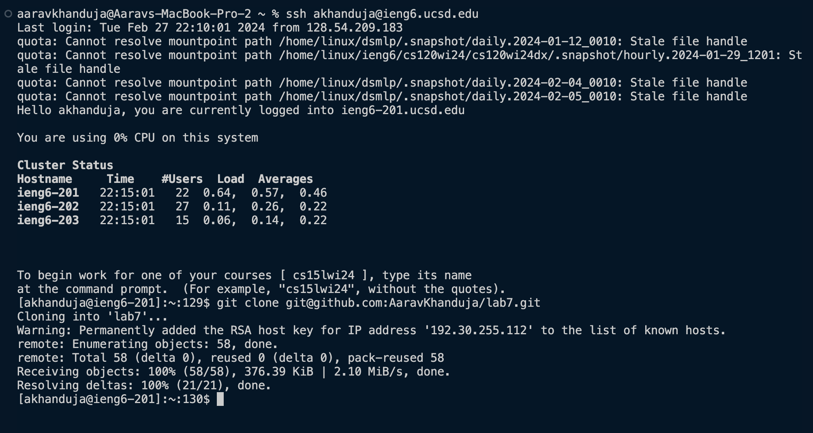
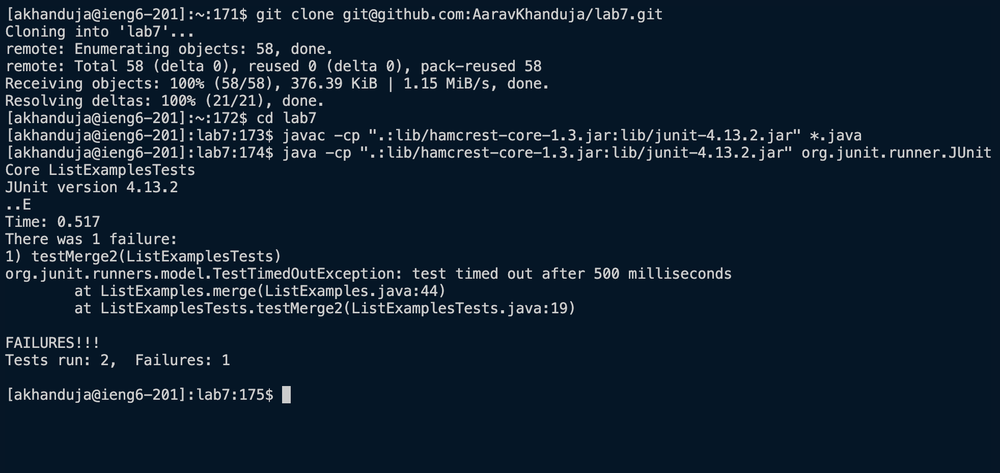
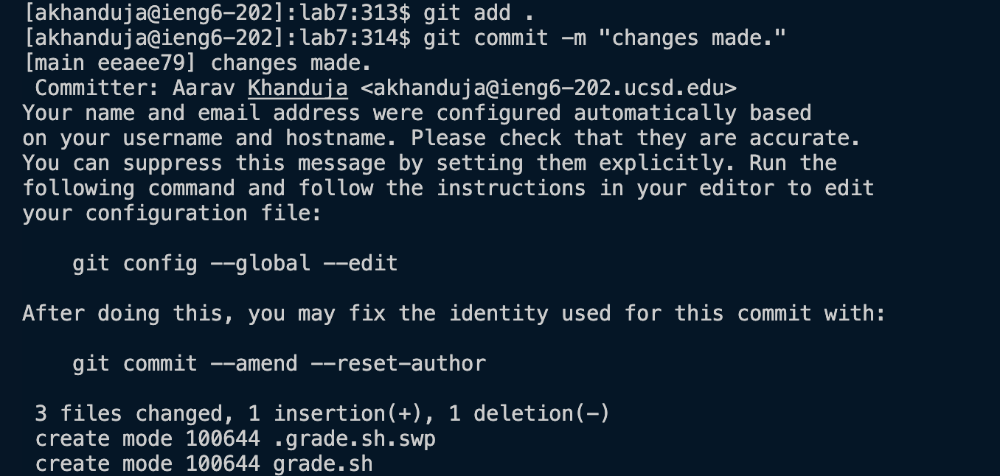
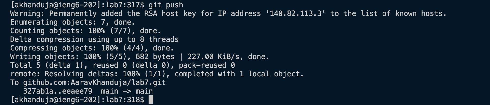

 
From the screenshot above, it can be inferred that I have logged into ieng6 using `ssh akhanduja@ieng6.ucsd.edu` and do not need a password as my keys have been set up already. 
I cloned the repository using `git clone <Ctrl+V>` which securely clones it on the ieng system.

I then ran the JUnit tests, 1 of which failed as you can see below. using the command `javac -cp <Ctrl+V>` and `java -cp <Ctrl+V>` 
\
 
In order to fix the ListExamples.java directly from the command line I used vim.  
I used the command ` vim ListExamples.java `   
I then used the following keystrokes:   

`
  <down> <down> <down> <down> <down> <down> <down> <down> 
  <a> 
  <left> <left> <left> <left> <left> <left> <left> 
  <Delete> 2 <Esc> 
  :w :qa! `
 

The `<left>` and `<down>` simply moved the cursor. `a` shifted the mode to append from where I could change `index1` to `index2` using the `<Delete>` and `2` keys. In order to save the changes in the file I used the command `:w` and then to exit `vim` I used the command `:qa!`. 

 
In order to run the tests again I used `<up>` to get the same commands to run JUnit tests. 
You can see from the screenshot above that they ran successfully. 
 
Finally, to commit and push the changes I ran the following commands in order:  
`git add .`  
`git commit -m "changes made." ` 
`git push` 
The screenshots below shows the same 

