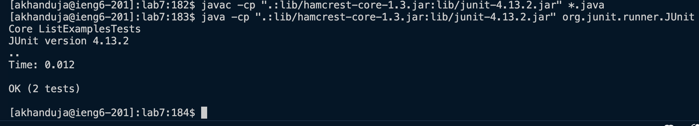

\
 
From the screenshot above, it can be inferred that I have logged into ieng6 using `ssh akhanduja@ieng6.ucsd.edu` and do not need a password as my keys have been set up already. 
I cloned the repository using `git clone git@github.com:AaravKhanduja/lab7.git` which securely clones it on the ieng system.

I then ran the JUnit tests, 1 of which failed as you can see below. using the command `javac -cp ".:lib/hamcrest-core-1.3.jar:lib/junit-4.13.2.jar" *.java` and `java -cp ".:lib/hamcrest-core-1.3.jar:lib/junit-4.13.2.jar" org.junit.runner.JUnitCore ListExamplesTests`
 
\

 
In order to fix the ListExamples.java directly from the command line I used vim.  
I used the command `vim ListExamples.java`  
I then used the following keystrokes:  
Keys pressed: 
`down-arrow` `down-arrow` `down-arrow` `down-arrow` `down-arrow` `down-arrow` `down-arrow`  
  <a>  
  `left-arrow` `left-arrow` `left-arrow` `left-arrow` `left-arrow` `left-arrow` `left-arrow`  
  <delete><2><esc>  
  <:w> <:qa!>  
The left arrows and down simply moved the cursor. `a` shifted the mode to append from where I could change index1 to index2 using the `delete` and `2` keys. In order to save the changes in the file I used the command `:w` and then to exit `vim` I used the command `:qa!`. 

In order to run the tests again I used <up-arrow> to get the same commands to run JUnit tests. You can see from the screenshot above that they ran successfully. 
 

